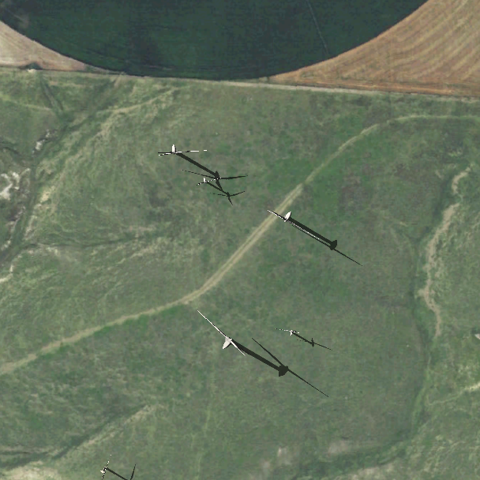
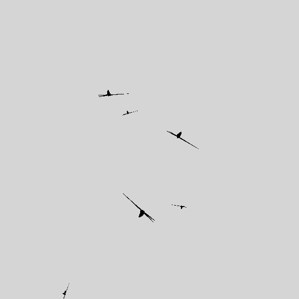

# CityEngine-Files
## Purpose
This repo contains the important CityEngine files that are used to generate synthetic overhead imagery of wind turbines. The input to this is a folder (maps) of 1300x1300 images. After using the script, it will generate four synthetic images per input image as well as corresponding black and white ground truth images that contain information about the locations of the wind turbines. These black and white ground truth images can then be used with the [Synthetic Label Generation](https://github.com/Duke-BC-DL-for-Energy-Infrastructure/Synthetic-Label-Generation) repo to generate YOLOv3 formatted labels.

    

## Using this repo
To use this repo, you need to first [install CityEngine](https://doc.arcgis.com/en/cityengine/latest/install/os-x/installing-cityengine.htm). Once you have installed CityEngine, open up an application and create a new project. Then, you can clone/download these files and copy and paste them into the project. 

After you open the project, in the file navigator in the bottom left, open up scripts/dynamic_shoot_wind_turbine.py. In the main function at the bottom, there is a group of lines starting with '''rgb''', and another starting with '''gt''', which stands for ground truth. The code under '''rgb''' will create the synthetic images, and the code under '''gt''' will create the black and white ground truth images. You'll likely want to comment the code under '''gt''' when running the code under '''rgb''' and vice versa. 

When running the code under '''rgb''', you will want to open up the drop down arrow next to the camera icon in the 3D View window and select the 135mm telephoto lens and turn on Shadows and Ambient occlusion. Make sure that Axes, Compass, and Grid are off. As previously mentioned, the code under '''gt''' should be commented out (the reasoning behind this is that you'll want shadows and ambient occlusion on for RGB images, but not for the gt images, so you need to change the setting before running that code). Then, in the upper left, go to Python -> Run Script. You should see the camera moving around in the 3D view. The RGB images will show up under the images/parent_folder/{display_type}_all_images_step{step_size} (set to images/synthetic_wind_turbine_images/color_all_images_step608)

When running the code under '''gt''', you will want to open up the drop down arrow next to the camera icon in the 3D View window and select the 135mm telephoto lens if you haven't already and turn off Shadows and Ambient occlusion. Make sure that Axes, Compass, and Grid are off. As previously mentioned, the code under '''rgb''' should be commented out. Then, in the upper left, go to Python -> Run Script. You should see the camera moving around in the 3D view and go to Window->Console you should also see text being printed there. You should also see a gray/white background and the black turbine models in the 3D scene view. The GT images will show up under the images/parent_folder/{display_type}_all_annos_step{step_size} (set to images/synthetic_wind_turbine_images/color_all_annos_step608).

Once the RGB and GT images are created, you can now use the [Synthetic-Label-Generation](https://github.com/Duke-BC-DL-for-Energy-Infrastructure/Synthetic-Label-Generation) repo to convert the black and white grouth truth images into YOLOv3 formatted labels.

## Errors
If the code does not do anything (you don't see any output or the camera isn't moving), then that means the code failed. CityEngine doesn't tell you when and where the code crashes, which makes debugging all the more fun! :)

This repo should work as is, so keep track of anything you have changed, and that would likely be the source of any errors.

One common error is the parent_folder (set default to images/synthetic_wind_turbine_images) doesn't exist, but as long as you have cloned this repo and haven't edited it, then that should not be an issue.
